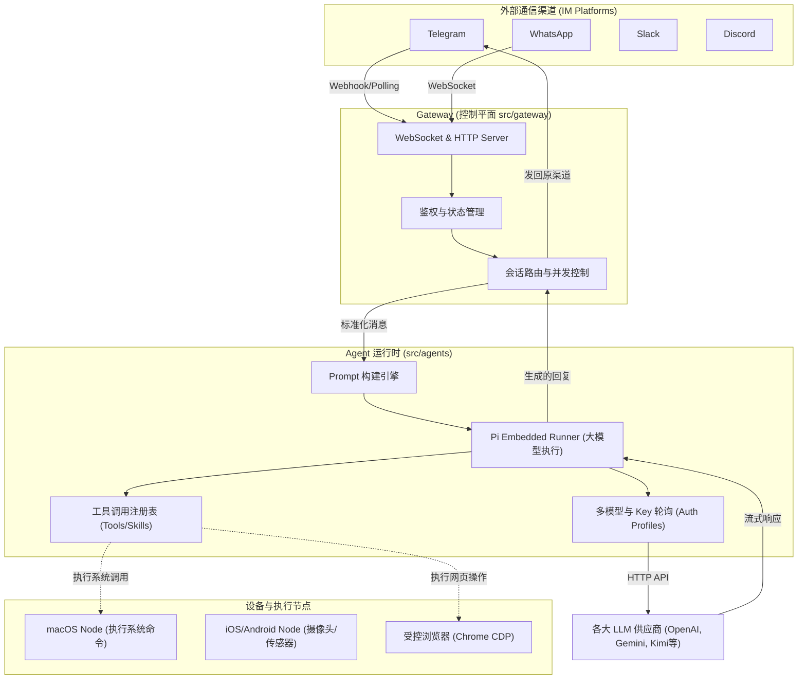

# OpenClaw 全局架构分析 (AGENT_01_OVERVIEW)

## 1. 项目简介与核心定位

**OpenClaw** 是一个个人 AI 助手系统，旨在运行在用户的自有设备上。它的核心定位是“一个多渠道的 AI 网关与代理系统”，让用户能在日常使用的聊天软件（如 WhatsApp, Telegram, Slack, Discord 等）中直接与专属的本地 AI 助手对话。

### 核心特性
*   **多渠道接入 (Multi-channel)**: 统一了各大即时通讯软件的收发信链路。
*   **本地优先网关 (Local-first Gateway)**: 控制平面运行在本地，负责会话、渠道、工具和事件的分发调度。
*   **多代理路由 (Multi-agent routing)**: 根据渠道、群组或私聊路由到不同的隔离 Agent 会话中。
*   **插件与工具生态**: 支持调用浏览器 (Browser control)、节点设备 (macOS/iOS/Android Nodes)、计划任务 (Cron) 以及丰富的扩展技能 (Skills)。
*   **高度灵活的模型回退与轮询**: 支持多模型 API Key 的高可用轮询与回退（我们将在后续章节深度剖析）。

## 2. 目录结构解析

通过对 `src/` 和项目根目录的探索，OpenClaw 的代码结构呈现出典型的“洋葱架构”或模块化核心架构的特征：

*   `src/gateway/`: **系统的心脏 (Control Plane)**。负责 WebSocket/HTTP 服务器的启动、连接管理、配置热重载、Auth 鉴权、各种客户端（WebUI、桌面端、移动节点）的长连接维持。
*   `src/channels/`: **通信渠道接入层**。对接了各种外部 IM 平台（如 `telegram/`, `slack/`, `whatsapp/`, `discord/` 等），将其标准化为 OpenClaw 的内部消息格式。
*   `src/agents/`: **核心大脑 (AI Runtime & Logic)**。包含 Prompt 的组装、大模型 API 的调用 (`pi-embedded-runner/`, `models-config.ts`)、多 API Key 轮询管理 (`auth-profiles/`) 以及沙盒环境 (`sandbox/`)。
*   `src/plugins/` & `src/plugin-sdk/`: **扩展机制**。定义了插件的标准 SDK，允许社区或用户开发独立的插件。
*   `src/cli/` & `src/commands/`: **命令行界面**。处理 `openclaw onboard`, `openclaw models` 等终端交互。
*   `src/infra/` & `src/process/`: **底层基础设施**。如事件总线、重试机制、系统级进程调用、SQLite 数据存储等。

## 3. 宏观架构图

以下是 OpenClaw 宏观架构流转图，展示了从外部消息输入到 AI 处理并响应的完整闭环。

### 架构关键点解读：

1.  **WebSocket 作为数据总线**: `src/gateway/server.impl.ts` 中启动了一个集成的 WS/HTTP 服务器。移动端、Mac 桌面端以及某些本地渠道都是通过 WebSocket 连接到 Gateway。
2.  **解耦的设计**: 渠道层不直接与大模型对话。渠道层接收到消息后，将其抛给 Gateway 的路由机制，路由分配给特定的 Agent Session (工作区)，再由 Agent (`Pi Embedded Runner`) 进行处理。
3.  **设备节点能力下放**: 诸如执行 Bash 命令、拍照截屏等危险或依赖设备硬件的操作，并非由 Gateway 直接执行，而是通过 WS 协议路由给对应的 Node（例如跑在 Mac 上的 OpenClaw App，或 iOS App）去执行，这种设计极大地提高了安全性和灵活性。

## 4. 下一步计划

在下一节中，我们将深入 `src/gateway/` 和 `src/agents/` 的核心边界，探索其并发模型、状态管理，并重点关注会话 (Session) 是如何在 “Think-Act” 循环中推进的 (`AGENT_02_CORE.md`)。