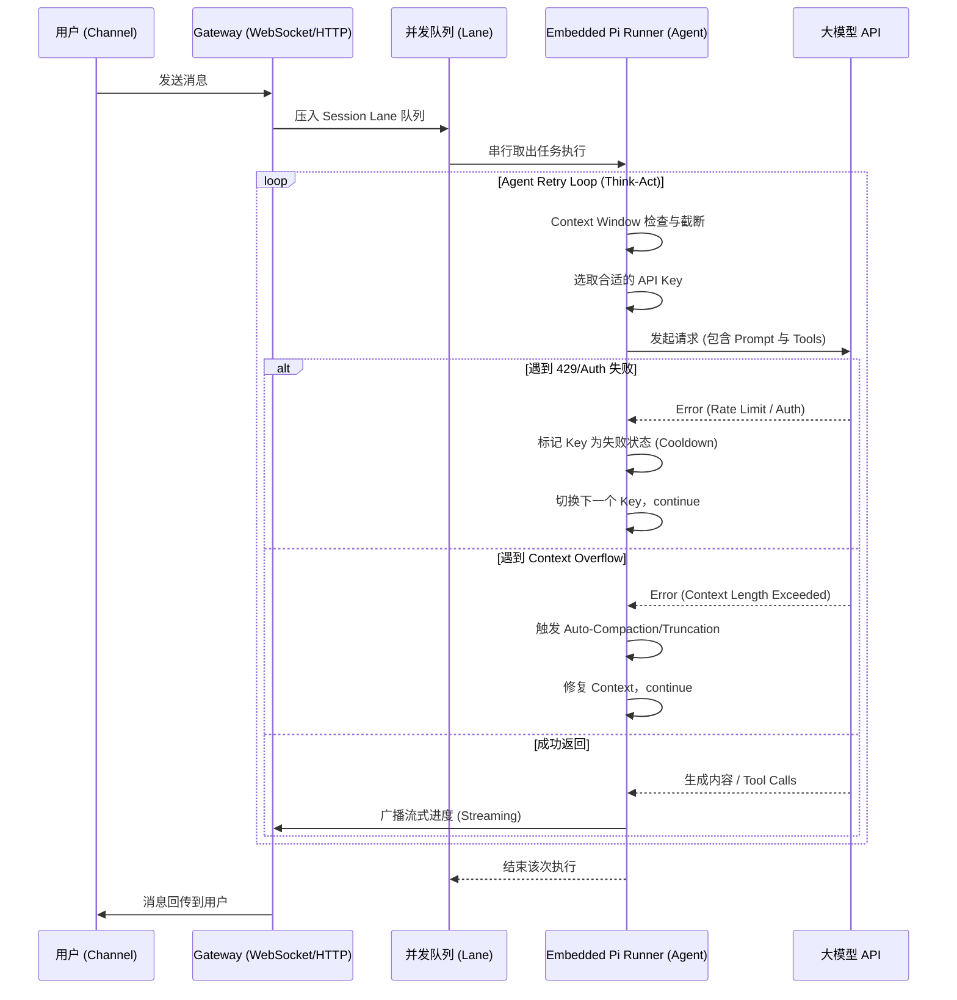

# 核心链路与并发模型 (AGENT_02_CORE)

## 1. 核心架构：Gateway 模式与本地优先

OpenClaw 采取了一个相对少见的架构：它自身是一个**完全运行在本地（或私有服务器）的 Gateway（网关）**。
在 `src/gateway/server.impl.ts` 中，我们看到了网关启动的完整生命周期：

1.  **配置与秘钥初始化**: `activateRuntimeSecrets` 激活配置和机密信息。
2.  **网关状态构建**: `createGatewayRuntimeState` 初始化 WebSocket、HTTP 服务器，以及所有与设备通信的上下文（控制平面）。
3.  **大模型运行时订阅**: `onAgentEvent` 订阅来自于底层 AI 引擎的执行事件。
4.  **长连接与节点同步**: 支持将移动设备 (iOS/Android) 注册为 Worker Node，由 `NodeRegistry` 负责调度任务（比如利用手机摄像头拍照）。

## 2. 并发模型 (Concurrency Model)

在传统应用中，请求往往是并行的无状态 HTTP 请求，但在 OpenClaw 中，一个会话（Session）拥有强状态（上下文、缓存）。为了避免大模型重复生成功和覆盖上下文，系统设计了基于 **Lanes (车道)** 的并发调度模型。

在 `src/process/command-queue.js` (引用于 `run.ts` 中的 `enqueueCommandInLane`) 实现了这一逻辑：
- **全局车道 (Global Lane)**：限制整个系统的最高并发上限。
- **会话车道 (Session Lane)**：同一个群组或同一个私聊对应一个 Session ID。这意味着**对于同一个对话对象，大模型的调用是完全串行的**。
- 这保证了哪怕用户连续发了三条消息，AI 也会等待上一条回复完毕并更新记忆后，再去处理下一条，避免了上下文污染。

## 3. "Think-Act" 循环 (Agent Loop)

最核心的 AI 执行逻辑位于 `src/agents/pi-embedded-runner/run.ts` 中的 `runEmbeddedPiAgent`。它实现了一个强健的 `while(true)` 循环，在这个循环中完成：

1. **环境准备与 Hook 拦截**: 允许插件在调用前修改 Provider/Model。
2. **鉴权解析**: 选择本次对话使用的 API Key (包含多 Key 轮询，见 `AGENT_03`)。
3. **上下文边界检查**: `evaluateContextWindowGuard` 确保输入的 Prompt 未超出限制。
4. **单次尝试 (runEmbeddedAttempt)**: 将 Prompt 发给大模型，获取回复或工具调用指令。
5. **上下文溢出与截断 (Auto-Compaction/Truncation)**: 如果返回上下文过大的错误，系统会自动通过 `contextEngine.compact` 或者裁剪多余的工具返回值 (`truncateOversizedToolResultsInSession`) 来修复上下文，然后**自动重试 (`continue`)**。
6. **网络/鉴权容错**: 遇到 429 或者鉴权失败时，触发轮询重试。

### 时序流转图

## 4. 总结

OpenClaw 的核心链路非常强调**容错**与**稳健性**。它没有使用脆弱的简单异步调用，而是用一个可重入、带自动截断记忆、带鉴权轮询的死循环保护起了每一次 LLM 调用。这种架构非常适合本地设备网关这样随时可能遇到网络波动、Key 限额、长对话溢出的复杂环境。