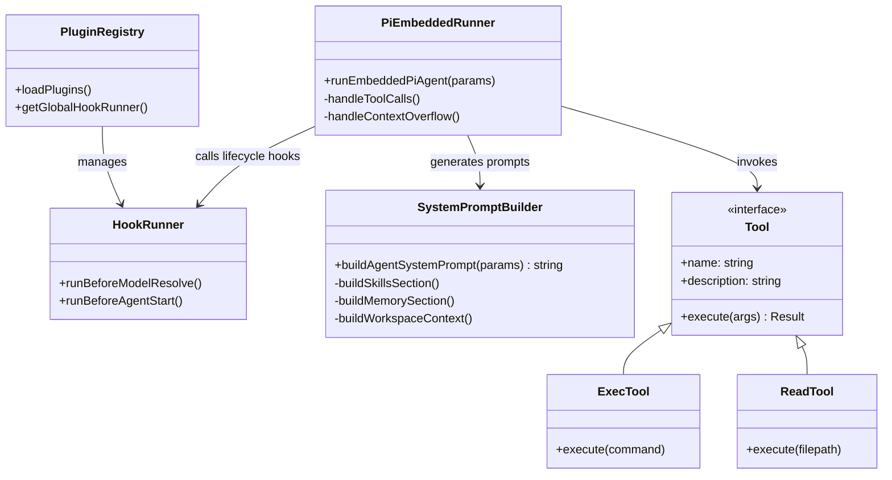

# Prompt 工程与插件化架构 (AGENT_04_PROMPT_PLUGINS)

## 1. Prompt 工程：系统级上下文构建

OpenClaw 使用了一套模块化、动态组装的 `System Prompt` 生成机制。它的核心实现在 `src/agents/system-prompt.ts`。

### 1.1 模块化组装
`buildAgentSystemPrompt` 函数将系统级指令划分为多个模块，根据当前运行时状态动态拼接：
*   **工具可用性说明 (`## Tooling`)**: 自动枚举当前会话启用的 Tools（如读写文件、浏览器、Node节点等），并附上每个工具的指引。
*   **沙盒状态 (`## Sandbox`)**: 如果 Agent 运行在 Docker 隔离环境，会自动注入宿主机路径与容器路径的映射说明。
*   **安全与行为准则 (`## Safety`)**: 强制要求“没有独立目标”、“禁止绕过安全规则”等准则，类似于 Anthropic Constitution。
*   **工作区上下文 (`## Workspace Files (injected)`)**: 这是非常关键的一点。系统会自动读取挂载目录下的 `AGENTS.md`、`SOUL.md`、`MEMORY.md` 等文件内容，直接作为文本块嵌入到 Prompt 中，实现 **“文档即 Prompt”** 的理念。

### 1.2 Think-Act 循环中的标签约束
为了让模型遵循特定的输出格式，Prompt 中定义了严格的 `<think>...</think>` 约束（当启用 Reasoning 模式时）：
> ALL internal reasoning MUST be inside <think>...</think>.
> Only the final user-visible reply may appear inside <final>.

## 2. 插件与工具机制 (Plugin & Tooling)

OpenClaw 的可扩展性主要由两部分组成：

1.  **内置工具 (Tools)**：定义大模型可以直接调用的本地函数（如 `exec`, `read`, `write`, `browser`）。
2.  **插件 SDK (`src/plugin-sdk/`)**: 允许用户或第三方编写外部包，注入新的路由、端点或修改行为。

### 2.1 核心工具调用 (Tool Call)
在 `pi-embedded-runner/run.ts` 中，模型返回的 JSON/Function Calling 会被自动解析。有趣的是系统提供了不同等级的“防灾”策略：
*   **自动修剪 (Truncation)**：如果 `exec` 返回的终端日志长达数十万 Token（直接打爆 Context Window），系统中的 `truncateOversizedToolResultsInSession` 会拦截并自动截断工具输出，并向大模型报告“已截断，请使用 grep 继续查看”，而不是直接抛出错误。
*   **沙盒执行 (Sandbox)**：许多敏感工具（如 bash exec）可以选择路由到专门的 Docker 容器中执行，实现物理层的应用隔离。

### 2.2 Hook 拦截机制
OpenClaw 在各个核心执行生命周期中埋了 Hooks（见 `src/plugins/`）：
*   `before_model_resolve`: 允许插件干预、劫持即将被调用的 Model 和 Provider。
*   `before_agent_start`: 可以在真正的对话生成前修改 Context 或 Prompt。

这种设计类似于中间件模式，使得系统的行为可以被非侵入式地修改。

## 3. 类图设计概念

下面是 OpenClaw 插件与提示词系统的概念级类图：

## 4. 总结
OpenClaw 的 Prompt 工程并不依赖复杂的外部向量库（如 LangChain 的重度封装），而是采用了极其务实的 **Markdown 文件注入** 加上 **自动上下文截断防灾**。插件机制则通过明确的 Hook 拦截器，保证了核心架构的整洁。